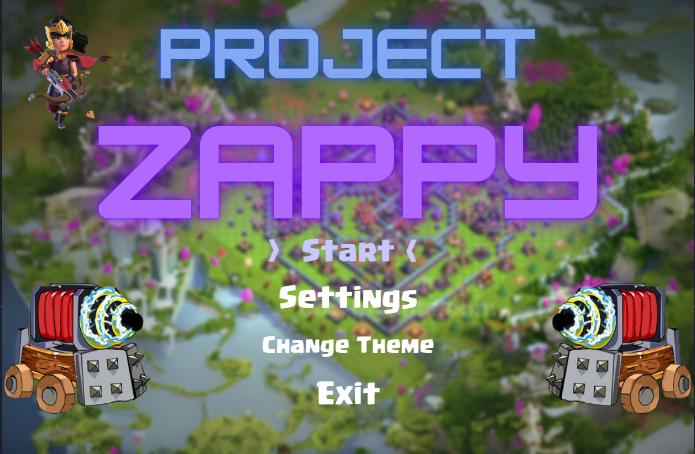
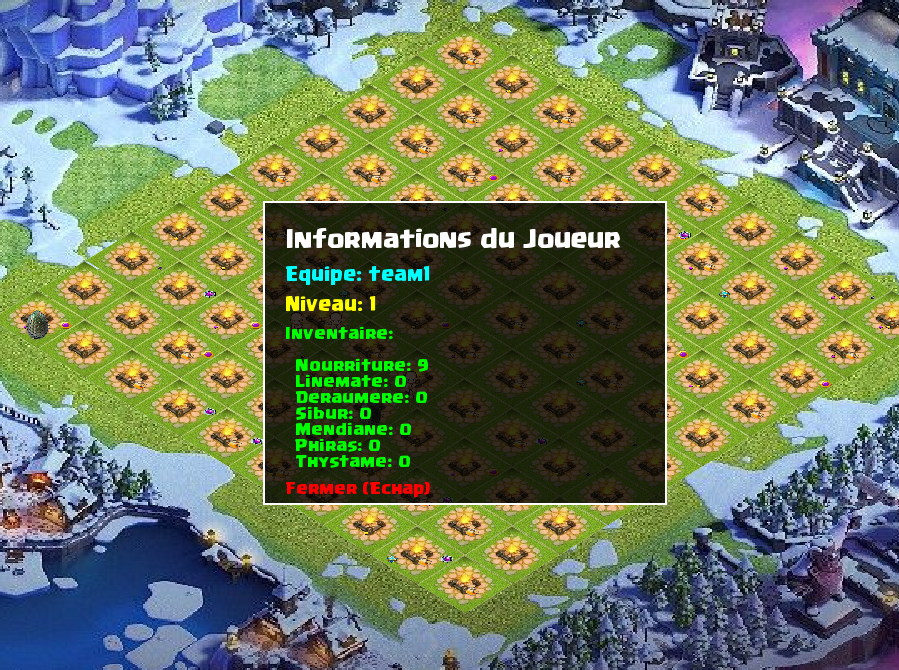

# 🎮 Zappy - Jeu de Stratégie Multijoueur

Zappy est un projet de jeu de stratégie multijoueur développé en C/C++ avec une interface graphique SFML, un serveur TCP et des clients IA en Python. Le jeu met en scène des équipes qui s'affrontent pour atteindre le niveau maximum et remporter la victoire.



## 📋 Table des Matières

- [Vue d'ensemble](#vue-densemble)
- [Composants du Projet](#composants-du-projet)
- [Prérequis](#prérequis)
- [Installation](#installation)
- [Utilisation](#utilisation)
- [Captures d'écran](#captures-décran)
- [Architecture](#architecture)
- [Protocole de Communication](#protocole-de-communication)

## 🎯 Vue d'ensemble

Zappy est un jeu de stratégie en temps réel où plusieurs équipes s'affrontent sur une carte hexagonale. Les joueurs doivent collecter des ressources, monter en niveau grâce à des incantations et survivre dans un environnement compétitif.

### Objectif du Jeu
- Être la première équipe à avoir 6 joueurs au niveau maximum (niveau 8)
- Collecter des ressources pour effectuer des incantations
- Gérer sa survie (nourriture) tout en progressant

## 🔧 Composants du Projet

### 1. **Serveur** (`zappy_server`)
- Serveur TCP multi-clients développé en C
- Gère la logique du jeu, les collisions, les ressources
- Communique avec les clients IA et l'interface graphique
- Implémente le système de survie et de régénération des ressources

### 2. **Interface Graphique** (`zappy_gui`)
- Interface graphique développée en C++ avec SFML
- Visualisation en temps réel de l'état du jeu
- Système de thèmes et paramètres personnalisables
- Caméra interactive avec zoom et déplacement


### 3. **Client IA** (`zappy_ai`)
- Bot intelligent développé en Python
- Stratégies de collecte et de montée en niveau
- Communication TCP avec le serveur
- Système de prise de décision autonome

## 📦 Prérequis

### Dépendances Système
```bash
# Ubuntu/Debian
sudo apt-get update
sudo apt-get install build-essential cmake libsfml-dev pkg-config python3

# Fedora/CentOS
sudo dnf install gcc gcc-c++ cmake SFML-devel pkgconfig python3

# macOS
brew install cmake sfml python3
```

### Versions Requises
- **CMake** >= 3.10
- **SFML** >= 2.5
- **Python** >= 3.6
- **Compilateur C/C++** avec support C++17

## 🚀 Installation

### Compilation Automatique
```bash
# Cloner le repository
git clone <votre-repo-url>
cd Zappy

# Compilation avec le script fourni
chmod +x build.sh
./build.sh
```

### Compilation Manuelle
```bash
# Créer le répertoire de build
mkdir -p build && cd build

# Configuration CMake
cmake ..

# Compilation
make

# Retour au répertoire principal
cd ..

# Rendre l'IA exécutable
chmod +x zappy_ai
```

### Compilation Sélective
```bash
# Compiler uniquement le serveur
make serveur

# Compiler uniquement la GUI
make gui

# Compiler uniquement l'IA
make ia
```

## 🎮 Utilisation

### 1. Démarrer le Serveur

```bash
./zappy_server -p <port> -x <largeur> -y <hauteur> -n <equipe1> <equipe2> ... -c <nb_clients> -f <freq>
    # ou
./zappy_server
```

**Paramètres :**
- `-p <port>` : Port d'écoute du serveur
- `-x <largeur>` : Largeur de la carte
- `-y <hauteur>` : Hauteur de la carte
- `-n <equipes>` : Noms des équipes (séparés par des espaces)
- `-c <nb_clients>` : Nombre de clients autorisés par équipe
- `-f <freq>` : Fréquence du serveur (unités de temps par seconde)

**Exemple :**
```bash
./zappy_server -p 4242 -x 10 -y 10 -n team1 team2 team3 -c 3 -f 10
```

### 2. Lancer l'Interface Graphique

```bash
./zappy_gui -p <port> -h <hostname>
```

**Paramètres :**
- `-p <port>` : Port du serveur
- `-h <hostname>` : Adresse IP du serveur (par défaut: localhost)

**Exemple :**
```bash
./zappy_gui -p 4242 -h localhost
```



### 3. Connecter des Clients IA

```bash
./zappy_ai -p <port> -n <nom_equipe> -h <hostname>
```

**Paramètres :**
- `-p <port>` : Port du serveur
- `-n <nom_equipe>` : Nom de l'équipe à rejoindre
- `-h <hostname>` : Adresse IP du serveur (par défaut: localhost)

**Exemple :**
```bash
./zappy_ai -p 4242 -n team1 -h localhost
```

### Exemple de Session Complète

```bash
# Terminal 1 - Serveur
./zappy_server -p 4242 -x 15 -y 15 -n Mystics Legends Warriors -c 4 -f 100

# Terminal 2 - Interface Graphique
./zappy_gui -p 4242 -h localhost

# Terminal 3 - Premier bot équipe Mystics
./zappy_ai -p 4242 -n Mystics -h localhost

# Terminal 4 - Deuxième bot équipe Legends
./zappy_ai -p 4242 -n Legends -h localhost

# Terminal 5 - Troisième bot équipe Warriors
./zappy_ai -p 4242 -n Warriors -h localhost
```

## 📸 Captures d'écran

### Menu Principal

*Interface du menu principal avec sélection des thèmes*

### Vue de Jeu

*Vue de la carte avec *le thème neige**

### Informations Joueur

*Panneau d'informations détaillées sur un joueur sélectionné*

### Informations Tuile

*Panneau d'informations sur les ressources d'une tuile*

## 🏗️ Architecture

### Structure du Projet
```
Zappy/
├── Server/           # Code du serveur C
│   ├── Commands/     # Gestion des commandes
│   ├── Data/         # Structures de données
│   ├── Update/       # Logique de mise à jour
│   └── World/        # Gestion du monde
├── GUI/              # Interface graphique C++/SFML
│   ├── Menu/         # Systèmes de menus
│   ├── Data/         # Structures de données GUI
│   └── Themes/       # Système de thèmes
├── Client/           # Client IA Python
├── Assets/           # Ressources graphiques et audio
└── Include/          # Headers partagés
```

### Flux de Communication
```
Client IA (Python) ←→ Serveur (C) ←→ GUI (C++/SFML)
                         ↑
                   Logique de Jeu
                   Gestion Ressources
                   Système de Survie
```

## 📡 Protocole de Communication

Le jeu utilise un protocole TCP personnalisé pour la communication entre les composants :

📋 **[Documentation complète du protocole → Protocol.md](Protocol.md)**

### Aperçu du Protocole

**Types de Communication :**
- **Client IA ↔ Serveur** : Commandes de jeu (Forward, Look, Take, Incantation, etc.)
- **GUI ↔ Serveur** : Requêtes d'information (positions, inventaires, état du monde)
- **Serveur → GUI** : Notifications temps réel (actions, événements, changements d'état)

**Caractéristiques :**
- **Protocol TCP** avec messages terminés par `\n`
- **Système de files d'attente** pour les commandes IA (10 commandes max)
- **Délais d'exécution** calculés selon la fréquence du serveur
- **Gestion d'erreurs** robuste (`ok/ko`)

Pour plus de détails sur les commandes, formats de messages et exemples d'usage, consultez la [documentation complète du protocole](PROTOCOL.md).

## 🎨 Fonctionnalités

### Interface Graphique
- **Thèmes Multiples** : Village principal, capital, nuit, guerre
- **Caméra Interactive** : Zoom et déplacement fluides
- **Informations Temps Réel** : Stats des joueurs et tuiles
- **Effets Visuels** : Animations des actions (incantations, mort, broadcast)
- **Interface Audio** : Musiques thématiques et effets sonores

### Intelligence Artificielle
- **Stratégies Adaptatives** : Collecte optimisée des ressources
- **Système de Survie** : Gestion automatique de la nourriture
- **Coopération** : Communication entre bots de la même équipe
- **Prise de Décision** : Algorithmes pour la montée en niveau

### Serveur
- **Multi-threading** : Gestion simultanée de multiples clients
- **Système de Ressources** : Régénération automatique
- **Validation** : Vérification de toutes les actions
- **Conditions de Victoire** : Détection automatique de fin de jeu

## 🛠️ Nettoyage

Pour nettoyer les fichiers compilés :

```bash
chmod +x clean.sh
./clean.sh
```

Ou manuellement :
```bash
rm -rf build/
rm -f zappy_server zappy_gui zappy_ai
```

## 📝 Licence

Ce projet est développé dans le cadre du cursus EPITECH.

## 👥 Équipe

Yanis Prevost  
Leo Gregori  
Tom Clerc  
Anthony Colombani-Gailleur  
Selim Bouasker  

---

🎮 **Bon jeu et que la meilleur IA gagne !** 🎮
